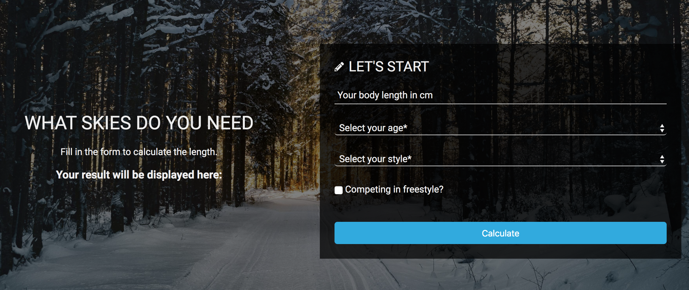
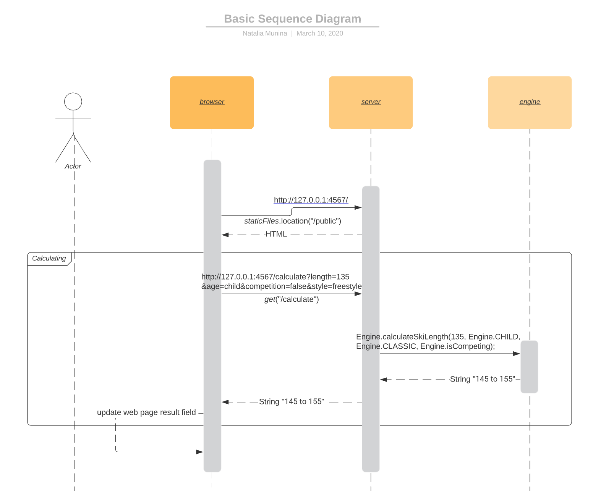

# Ski length calculator
> A web application (server and client) that helps the user to choose
  the right length of cross-country skis.

Education client-server application with focus on • Design • Structure • Readabilty • Testability • Maintainability of code.



## Getting Started

Start server

```
mvn clean compile exec:java
``` 

Star web page

```
http://127.0.0.1:4567/
```

## Built With

* [IntelliJ IDEA](https://www.jetbrains.com/idea/) - The Java framework used
* [Maven](https://maven.apache.org/) - Dependency Management
* [JUnit](https://junit.org/) - Used for testing
* [Spark Framework](http://sparkjava.com/l) - Server framework

Frontend:

* [W3Docs HTML Form Templates](https://www.w3docs.com/learn-html/html-form-templates.html)
* [Foto Simon Matzinger](https://unsplash.com/photos/-O8r5oLosYo)


## Meta

Natalia Munina – [Linkedin @munina](https://www.linkedin.com/in/munina/)

## Requirements
[User stories](ToDo.md) can be found in separate document.

Basic sequence diagram


